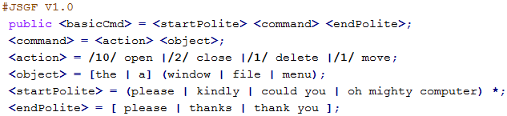

# Stream TV
A Multimodal Streaming Application:
- play a video stream;
- manage a play-list with your smartphone;
- control the player with speech, gestures and gesticulations;
- configure input modalities.

## Server (Desktop)

The Multimodal Server Architecture takes multimodal inputs and merge them into a semantic frame using different grammars:

- the interpreter controls the life cycle of each modality and realizes the multimodal fusion;
- each mode recognizes the input signals and notifies the results through an event;
- the recognized sequences are placed in a multidimensional stream to be integrated into a single multimodal frame;
- the application receives the frames and generates a feedback for the user.
  

 
### Speech Recognition (Sphinx4)

A pure Java speech recognition library that provides a quick and easy API to convert the speech recordings into text. 
LiveSpeechRecognizer returns recognition results such as recognized utterance, list of words with time stamps, recognition lattice and confidence values. The words contained in the hypothesis with the highest probability are evaluated in chronological order to rebuild the full command.

### Face Recognition

### Gesture Recognition

## Client (Android)
